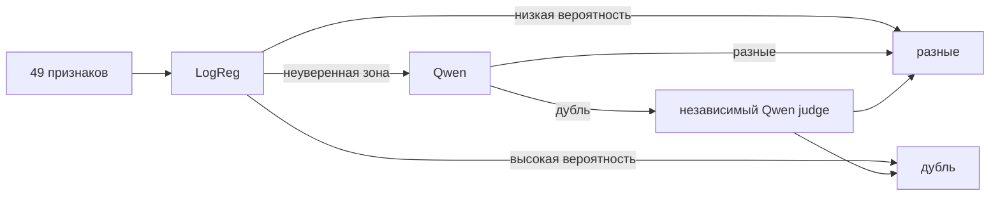

# `dedup` — стейдж (+ `pauk dedup graph`)

**Что здесь:** правила слияния дублей персон/публикаций/репозиториев и
разница между дедупом внутри группы и дедупом по всему графу.

**Какие файлы задействует:** `pauk/pipeline/stages/dedup.py`,
`pauk/graph/dedup.py`.

Схлопывает записи prepared-слоя, описывающие одну и ту же реальную
сущность — персону, публикацию, репозиторий. Идёт после всех стадий,
которые что-либо загружают, — работает над их результатом. После него в
`ALL_STAGES` остаются только те, кому нужны уже схлопнутые записи:
`github_match` и `author_names`.

Два уровня, общая логика, разные источники строк:

| | `pipeline/stages/dedup.py` | `graph/dedup.py` |
|---|---|---|
| Команда | часть `pauk enrich`/`pauk run` | `pauk dedup graph`, отдельно |
| Видит | одну группу | весь Neo4j, все опубликованные группы |
| Источник строк | MongoDB (prepared, своя группа) | Cypher-запросы к графу |
| Куда пишет | MongoDB + журнал в группе | Neo4j + журнал в `data/cache/` |
| Зачем нужен отдельно | ловит дубли внутри одного сбора | ловит дубли, чьи записи попали из **разных** прогонов и никогда не встречались бок о бок в одной группе |

Правила слияния (`plan_person_merges`, ранжирование публикаций/репозиториев)
— общие функции, импортируемые `graph/dedup.py` из
`pipeline/stages/dedup.py`, не дублируются.

## Персоны

Три источника доказательства совпадения:

1. **ORCID** — два человека с одним ORCID это один человек. Разные ORCID
   — явное доказательство обратного, пара никогда не сливается и даже не
   попадает в журнал (не о чем сообщать).
2. **Вариант имени** — display name одного человека числится среди
   `name_variants` другого, оба ИТМО, есть хотя бы один общий соавтор.
3. **Идентичное полное имя + подтверждение** — оба ИТМО, имя
   многотокенное (не одно слово), имя не дано инициалами, и есть хотя бы
   одно из: общий соавтор, общий департамент, общее исследовательское
   поле (`Publication.fields`).

**Имя — улика, не доказательство.** Транслитерация схлопывает разные
русские имена в одну латинскую строку, частые фамилии (Смирнов, Новиков,
Иванов) сталкиваются внутри пула авторов одного университета — при аудите
слияния только по имени нашёлся реальный кейс: «И. В. Смирнов»,
рецензент по медицинской антропологии, слитый с «И. В. Смирновым»-химиком.
Явно различающееся поле идентичности (ORCID, email, GitHub-логин,
Google Scholar id) навсегда держит пару раздельно, даже
если остальное совпадает. Пары со слабой уликой — вариант без общего
соавтора, тёзка вне ИТМО, однотокенное имя, идентичное имя без единого
подтверждения — никогда не сливаются автоматически, попадают в журнал с
причиной, человек остаётся раздельным, пока кто-то не подтвердит вручную.

**Групповой конфликт.** Слияние транзитивно (A=B, B=C ⇒ A=C по union-find),
но попарные проверки не видят транзитивных противоречий — A и B могут
законно совпасть с мостом-персоной M, но отличаться друг от друга. Если
компонента охватывает несколько значений explicit-поля идентичности, она
разрезается по этим значениям. Записи без конфликтующего идентификатора
присоединяются к единственному ближайшему корню по положительным связям;
равноудалённый мост остаётся на ручной разбор. Разбиение повторяется для
следующего конфликтующего поля, поэтому каждая полученная группа внутренне
непротиворечива. Так сохраняются и точные слияния по ORCID/staff id, и
однозначные записи без идентификатора, а одна ошибочная связь больше не
отменяет всю компоненту. Противоречивые ручные ответы остаются
all-or-nothing: выбирать произвольную половину из A=B, B=C, A≠C нельзя.

### Confidence-based resolver

Новый алгоритм используется и стадией `dedup` внутри группы, и командой
`pauk dedup graph` вместо прежней эвристики. `graph/person_resolution.py`
содержит признаки, prompt-контракты обоих Qwen-этапов, сериализацию
доказательств и конечный автомат решений. Обученные параметры LogReg лежат
отдельно в `graph/artifacts/person_resolution_logreg.pkl` и валидируются при
загрузке. Вызовы моделей, кэширование и журналирование находятся в
`pipeline/person_resolution.py`, а сбор признаков и построение плана слияний —
в `pipeline/person_resolution_planner.py`.

Кандидатные пары по имени строятся только по токенам длиннее двух символов
после удаления пунктуации. Поэтому компактные инициалы вроде `A.A.` и `Yu.`
не создают большие ложные корзины; ORCID и staff id остаются отдельными
каналами блокировки. Перед автоматическим слиянием дополнительно проверяется
порядок-независимая совместимость полных токенов имени. Неподтверждённый
конфликт уходит в модельный разбор маршрутом `surname_mismatch`.

ORCID, staff id, профильные идентификаторы и конфликт инициалов проверяются
до вероятностного решения. Границы не зашиты в логику: воспроизведённый
профиль использует `0.0624531492 / 0.977407873`; это границы без ошибок на
групповой OOF-валидации. Другой режим задаётся через `ResolverPolicy`.

Настройки окружения: `PAUK_PERSON_RESOLUTION_ENABLED`,
`PAUK_PERSON_RESOLUTION_MODEL`, `PAUK_PERSON_RESOLUTION_LOGREG_MODEL_PATH`,
`PAUK_PERSON_RESOLUTION_CONCURRENCY`,
`PAUK_PERSON_RESOLUTION_SEPARATE_BELOW` и
`PAUK_PERSON_RESOLUTION_MERGE_FROM`. Если ключ OpenRouter отсутствует или
ответ модели невалиден, пара не сливается и остаётся со статусом `held`.
Чтобы заменить LogReg, достаточно положить новый доверенный pickle-артефакт
той же схемы и указать путь в `PAUK_PERSON_RESOLUTION_LOGREG_MODEL_PATH`;
порядок и количество признаков проверяются до первого решения.

Пары со статусом `held` автоматически записываются в очередь ручного ревью,
а решения оператора учитываются в следующем прогоне. JSONL-журнал сохраняется
как полный аудит результатов прогона.

На контрольной выборке выбранный двухступенчатый вариант дал 91 верное и
6 ложных слияний среди 97 принятых (6,19%). На изолированной копии полного
графа он сформировал 347 компонент и убрал 430 дублирующих профилей. Это
оценка эксперимента, а не гарантия для production.

## Публикации

Одна работа доходит до OpenAlex несколькими путями: препринт и версия
записи, депозит датасета/софта, переиндексированный дубликат одного DOI.
Строки с общим DOI или общим заголовком — одна публикация. Слияние
безлосс: каждая запись сворачивается в `versions`
(`PublicationVersion` — заголовок/DOI/журнал/дата/абстракт/авторы именно
этой записи), поэтому все места, где работа появлялась, остаются доступны
на выжившей строке даже после слияния.

Представитель для оставшейся строки: `article` > (прочие типы, включая
отсутствующий) > `preprint`; при равенстве — более новая дата, затем
больше авторов, id как последний тайбрейкер.

**Журнал версий (`versions`) перестраивается из сырых данных, не из
предыдущего состояния** (`_refresh_version_ledger`) — запись, сделанная
после слияния, описывала бы уже объединённое состояние (union авторов
всех слитых записей), а не то, что несла именно эта запись. Только
raw-коллекция `openalex_works` (сырые ответы) остаётся верным по-записно источником.

## Репозитории

`github_id` — тот же репозиторий, даже если URL успел разойтись
(переименование/передача владения). Фолбэк для строк, у которых
`github_id` ещё не известен (стейдж `repositories` не добежал/упал) —
совпадение по нормализованному `url`. Отдельно: URL, процитированный
двумя разными строками — признак переименования между прогонами, старая
строка держит цитату по старому имени, новая заведена под уже
канонизированным URL с сервера. Все URL, под которыми репозиторий когда-либо
цитировался, накапливаются в `cited_urls`.

## Журнал решений — не потеряно, но и не доверено слепо

`dedup_candidates.jsonl` (в группе) / `dedup_candidates_graph.jsonl` (в
`data/cache/`) — каждое решение записано: применённые слияния со
статусом `merged` и правилом, которое их обосновало (для аудита и
возможного отката через `merged_ids`); отложенные пары/группы — статусом
`held`, маршрутом и причинами в одинаковых полях `route`, `reason` и
`held_because`. Счётчики `dedup_component_conflicts` и
`graph_dedup_component_conflicts` отдельно показывают конфликтные компоненты
в итогах прогона. Ни одна эвристика не остаётся невидимой.

Проверка `person_shared_orcid` в разделе «Дубликаты» показывает ORCID,
которые после прогона всё ещё принадлежат нескольким узлам персон, и даёт
список этих узлов для разбора.

Отложенное уходит ещё и в Mongo, в очередь вопросов
(`pauk/storage/review.py`, коллекция `review_pairs`), где на него отвечает
человек в панели. Ответы читаются **до** правил, обеими точками вызова
`plan_person_merges`: «один человек» сливает пару с правилом `manual`,
«разные» держит её раздельно. Правила при этом досчитываются до конца: если
пара с ответом «разные» теперь прошла бы по правилу, она не сливается, а
пишется строкой `disputed` — на неё смотрит человек. Проверку группы на
противоречие ответ не отменяет: конфликтующие части группы с двумя ORCID не
сливаются, даже если кто-то сказал «один человек»; точные непротиворечивые
подгруппы при этом могут быть схлопнуты. Ответ хранится под id, которые мог уже
свернуть дедуп, поэтому ответы читаются через карту `merged_ids`
(`folded_ids` для строк, `fetch_merged_id_map` для графа). Кто из пары
остаётся, решает `merge_rank` — одно правило для дедупа и для панели.

## Дедуп в графе не рвёт уже опубликованные связи

`Neo4jClient._fold_nodes_batch` переносит все входящие/исходящие связи с
дубля на канонический узел (существующая связь канонического узла
побеждает при конфликте, свойства дубля только заполняют пробелы),
удаляет дубль только после переноса. `merged_ids` остаётся на
каноническом узле — если более поздний `publish graph` от **старой**
группы попытается воскресить id, уже схлопнутый графовым дедупом,
`jsonl_loader.py` перефолдит его сразу в конце загрузки
(`fetch_merged_id_map`), не дожидаясь следующего `pauk dedup graph`.
