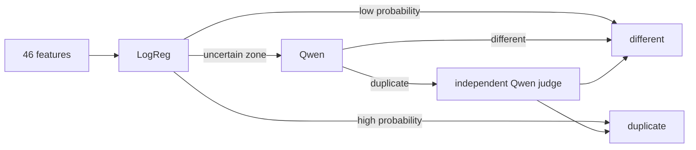

# `dedup` stage (and `pauk dedup graph`)

**What this covers:** the rules for merging duplicate persons, publications and
repositories, and how dedup within a group differs from dedup across the whole
graph.

**Files involved:** `pauk/pipeline/stages/dedup.py`, `pauk/graph/dedup.py`.

Collapses prepared-layer records that describe the same real entity: a person,
a publication or a repository. It runs after every stage that loads anything,
since it works on their output. Only the stages that need already-folded
records come after it in `ALL_STAGES`: `github_match` and `author_names`.

Two levels share the logic but differ in where rows come from:

| | `pipeline/stages/dedup.py` | `graph/dedup.py` |
|---|---|---|
| Command | part of `pauk enrich` / `pauk run` | `pauk dedup graph`, separate |
| Sees | one group | the whole Neo4j graph, all published groups |
| Row source | MongoDB (prepared, own group) | Cypher queries on the graph |
| Writes to | MongoDB + journal in `data/audit/<group>/` | Neo4j + journal in `data/cache/` |
| Why separate | catches duplicates within one collection run | catches duplicates whose records came from **different** runs and never met in one group |

The merge rules (`plan_person_merges`, the ranking of publications and
repositories) are shared: `graph/dedup.py` imports them from
`pipeline/stages/dedup.py` rather than duplicating them.

## Persons

The rule-based planner (`plan_person_merges`, the fallback when the resolver
below is disabled) uses four sources of evidence for a match:

1. **ORCID**: two persons with the same ORCID are one person. Different ORCIDs
   are explicit evidence to the contrary: the pair is never merged and does not
   even enter the journal (there is nothing to report).
2. **Name variant**: one person's display name is among the other's
   `name_variants`, both are ITMO, and they share at least one coauthor.
3. **Identical full name plus corroboration**: both are ITMO, the name has
   several tokens, it is not given as initials, and at least one of these
   holds: a shared coauthor, a shared department, a shared research field
   (`Publication.fields`).
4. **Staff record**: both are ITMO and their names resolve to the same row of
   the official ITMO staff catalog. One row is one employee, so this bridges
   spellings the other rules cannot.

**A name is evidence, not proof.** Transliteration collapses distinct Russian
names into one Latin string, and common surnames (Smirnov, Novikov, Ivanov)
collide inside one university's author pool. An audit of name-only merging
found a real case: "I. V. Smirnov", a reviewer on medical anthropology, merged
with "I. V. Smirnov" the chemist. An explicitly different identity field
(ORCID, email, GitHub login, Google Scholar id, staff record) keeps a pair
apart for good, even if everything else matches. Pairs with weak evidence (a
variant without a shared coauthor, a namesake outside ITMO, a single-token
name, an identical name with no corroboration) are never merged automatically.
They go into the journal with a reason and stay separate until someone confirms
them by hand.

**Group conflict.** Merging is transitive (A=B, B=C implies A=C via
union-find), but pairwise checks do not see transitive contradictions: A and B
may each legitimately match a bridge person M while differing from each other.
A group that spans more than one value of an explicit identity field (two
different ORCIDs in one group, etc.) is rejected as a whole and journalled for
manual review; it is not merged partially.

### Confidence-based resolver

When `PAUK_PERSON_RESOLUTION_ENABLED` is true (the default), both the `dedup`
stage and `pauk dedup graph` use the resolver below instead of the rule-only
planner. `graph/person_resolution.py` holds the features, the prompt contracts
of both Qwen steps, evidence serialization and the decision state machine. The
trained LogReg parameters are stored separately in
`graph/artifacts/person_resolution_logreg.pkl` and validated on load. Model
calls, caching and logging are in `pipeline/person_resolution.py`; feature
collection and building the merge plan are in
`pipeline/person_resolution_planner.py`.

```mermaid
flowchart LR
    A[46 features] --> B[LogReg]
    B -->|low probability| C[different]
    B -->|high probability| D[duplicate]
    B -->|uncertain zone| E[Qwen]
    E -->|different| C
    E -->|duplicate| F[independent Qwen judge]
    F --> C
    F --> D
```

ORCID, staff id, profile identifiers and an initials conflict are checked
before the probabilistic decision. The thresholds are not hard-coded:
`ResolverPolicy` defaults to `separate_below=0.05` and `merge_from=0.99`, and
another mode is set through the environment.

Environment settings: `PAUK_PERSON_RESOLUTION_ENABLED`,
`PAUK_PERSON_RESOLUTION_MODEL`, `PAUK_PERSON_RESOLUTION_LOGREG_MODEL_PATH`,
`PAUK_PERSON_RESOLUTION_CONCURRENCY`, `PAUK_PERSON_RESOLUTION_SEPARATE_BELOW`
and `PAUK_PERSON_RESOLUTION_MERGE_FROM`. If the OpenRouter key is missing or a
model response is invalid, the pair is not merged and gets the status `held`.
To replace the LogReg model, put a new trusted pickle with the same schema in
place and point `PAUK_PERSON_RESOLUTION_LOGREG_MODEL_PATH` at it; the feature
order and count are checked before the first decision.

Pairs with status `held` are written to the manual review queue automatically,
and operator answers are applied on the next run. The JSONL journal remains as
the full audit of the run.

## Publications

One work reaches OpenAlex by several routes: a preprint and a version of
record, a dataset or software deposit, a re-indexed duplicate of one DOI. Rows
sharing a DOI or a title are one publication. The merge is lossless: each
record is folded into `versions` (`PublicationVersion`: the title, DOI,
journal, date, abstract and authors of that particular record), so every place
the work appeared stays available on the surviving row.

The representative of the surviving row: `article` > other types (including a
missing type) > `preprint`; on a tie, the newer date, then more authors, then
the id as the last tiebreaker.

**The version ledger (`versions`) is rebuilt from raw data, not from the
previous state** (`_refresh_version_ledger`). An entry written after a merge
would describe the merged state (the union of authors of all merged records)
instead of what that record carried. Only the raw `openalex_works` collection
remains a correct per-record source.

## Repositories

The same `github_id` means the same repository even if the URLs have diverged
(rename or ownership transfer). For rows whose `github_id` is not known yet
(the `repositories` stage did not finish or failed), the fallback is a match on
the normalized `url`. Also, a URL cited by two different rows signals a rename
between runs: the old row holds the citation under the old name, and the new
one was created under the URL already canonicalized by the server. Every URL
under which a repository was ever cited accumulates in `cited_urls`.

## The journal: nothing is lost, nothing is trusted blindly

`dedup_candidates.jsonl` (in `data/audit/<group>/`) and
`dedup_candidates_graph.jsonl` (in `data/cache/`) record every decision. Applied
merges have status `merged` and the rule that justified them (for audit and a
possible rollback through `merged_ids`); deferred pairs and groups have status
`held` and their reasons. No heuristic stays invisible.

Held items also go to Mongo, into the question queue (`pauk/storage/review.py`,
collection `review_pairs`), where a person answers them in the admin panel.
Answers are read **before** the rules, by both call sites of
`plan_person_merges`: "same person" merges the pair with the rule `manual`,
"different" keeps it apart. The rules are still evaluated in full: if a pair
answered "different" would now pass by a rule, it is not merged but written as a
`disputed` row for a person to look at. An answer does not override the group
contradiction check: a group with two ORCIDs is rejected even if someone said
"same person". An answer is stored under ids that dedup may have already
folded, so answers are read through the `merged_ids` map (`folded_ids` for
rows, `fetch_merged_id_map` for the graph). `merge_rank` decides which of a
pair survives, one rule for dedup and for the panel.

## Graph dedup does not break published links

`Neo4jClient._fold_nodes_batch` moves all incoming and outgoing relationships
from the duplicate to the canonical node (an existing relationship of the
canonical node wins on conflict; the duplicate's properties only fill gaps) and
deletes the duplicate only after the move. `merged_ids` stays on the canonical
node. If a later `publish graph` from an **older** group tries to resurrect an
id already folded by graph dedup, `jsonl_loader.py` re-folds it at the end of
the load (`fetch_merged_id_map`) without waiting for the next
`pauk dedup graph`.
