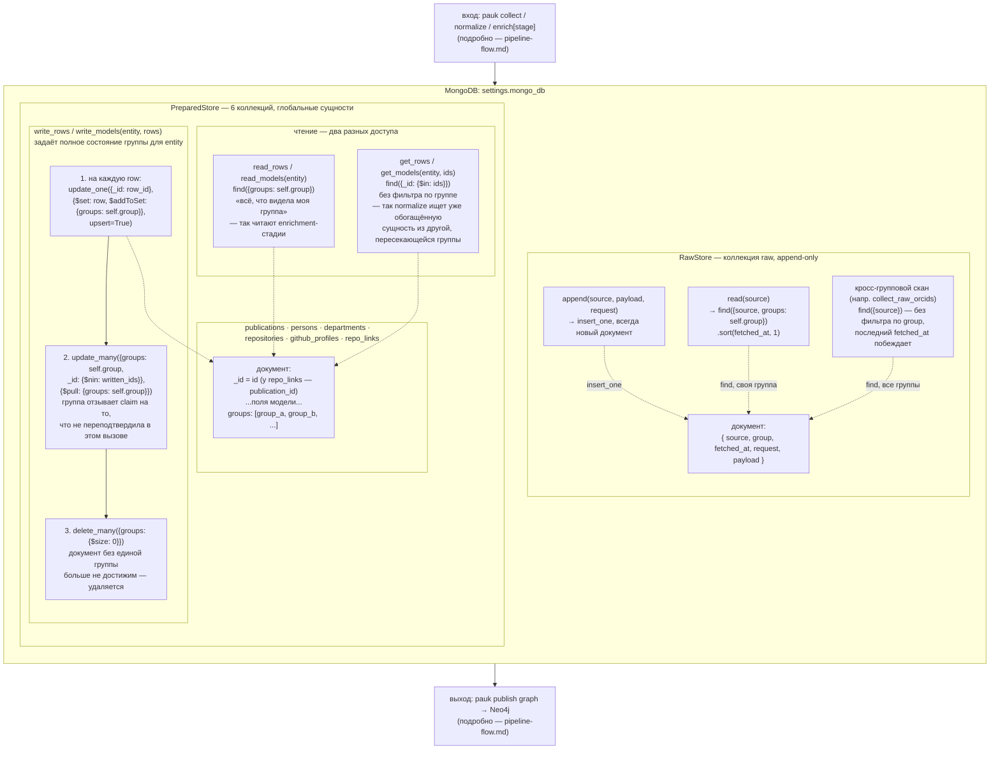

# Слой хранения MongoDB (raw + prepared)

Подробности `PreparedStore`/`RawStore` — крупным планом; вход в этот слой
(кто и зачем читает/пишет) — см. [`pipeline-flow.md`](pipeline-flow.md),
здесь он показан кратко. Прозаическое описание — [`../architecture/storage.md`](../architecture/storage.md).

## Почему два способа чтения

`read_rows`/`read_models` — рабочий набор своей группы, им пользуются
все стадии `enrich` без исключения: они видят и переписывают только то,
что уже отмечено их группой.

`get_rows`/`get_models` — точечный лукап по id, без разбора по группам.
Единственный сегодняшний потребитель —
`OpenAlexNormalizer._seed` (`pauk/pipeline/normalize.py`): раз
сущности глобальные, работа, уже сделанная над этим id **другой**
группой, не должна теряться только потому, что текущая группа видит
его впервые.

## Почему запись — не просто upsert

Каждая стадия по контракту читает **весь** рабочий набор своей группы
для сущности, мутирует, пишет **весь** набор обратно — тот же контракт,
что раньше был у перезаписи файла целиком. Шаги 2–3 воспроизводят
именно это: если строка была в рабочем наборе группы, но в этот раз не
переподтверждена (свёрнута dedup-стадией, переименована при
ренормализации), запись группы на неё снимается, а документ, оставшийся
без единой группы, удаляется — иначе он повис бы в коллекции
недостижимым мусором.

## Ключ документа не всегда `id`

`_id` — значение поля-ключа сущности. Для всех сущностей это `id`,
кроме `repo_links`: у `RepoLink` нет собственного `id`, ключ —
`publication_id` (одна строка на публикацию, список ссылок внутри).
