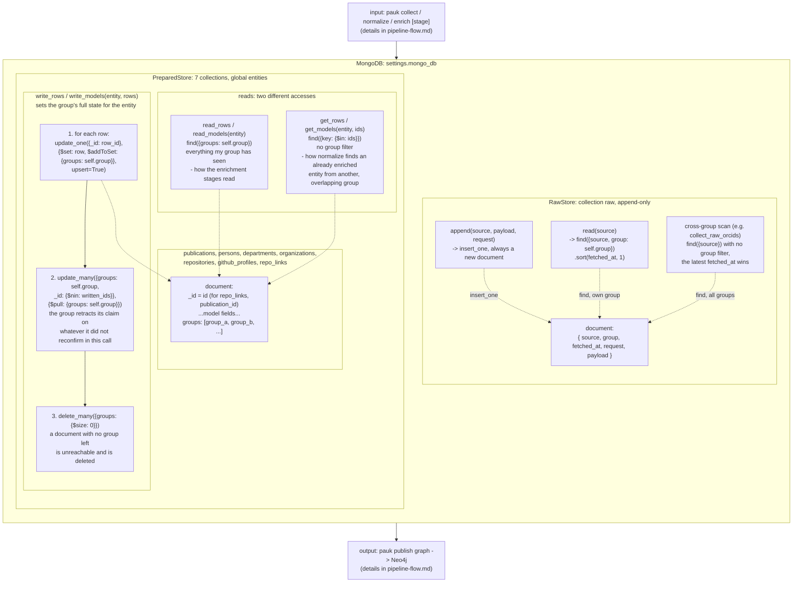

# MongoDB storage layer (raw + prepared)

A close-up of `PreparedStore` and `RawStore`; the entry into this layer (who
reads and writes it, and why) is in [`pipeline-flow.md`](pipeline-flow.md) and
shown only briefly here. Prose description:
[`../architecture/storage.md`](../architecture/storage.md).

```mermaid
flowchart TB
    IN["input: pauk collect / normalize / enrich [stage]<br/>(details in pipeline-flow.md)"]
    IN --> DB

    subgraph DB["MongoDB: settings.mongo_db"]
        direction TB

        subgraph RAWSTORE["RawStore: collection raw, append-only"]
            direction TB
            RDOC["document:<br/>{ source, group, fetched_at, request, payload }"]
            RAPP["append(source, payload, request)<br/>-> insert_one, always a new document"]
            RREAD["read(source)<br/>-> find({source, group: self.group})<br/>.sort(fetched_at, 1)"]
            RCROSS["cross-group scan (e.g. collect_raw_orcids)<br/>find({source}) with no group filter,<br/>the latest fetched_at wins"]
            RAPP -.->|"insert_one"| RDOC
            RREAD -.->|"find, own group"| RDOC
            RCROSS -.->|"find, all groups"| RDOC
        end

        subgraph PREPSTORE["PreparedStore: 7 collections, global entities"]
            direction TB

            subgraph COLLS["publications, persons, departments, organizations,<br/>repositories, github_profiles, repo_links"]
                direction LR
                PDOC["document:<br/>_id = id (for repo_links, publication_id)<br/>...model fields...<br/>groups: [group_a, group_b, ...]"]
            end

            subgraph READS["reads: two different accesses"]
                direction TB
                GROUPREAD["read_rows / read_models(entity)<br/>find({groups: self.group})<br/>everything my group has seen<br/>- how the enrichment stages read"]
                IDREAD["get_rows / get_models(entity, ids)<br/>find({key: {$in: ids}})<br/>no group filter<br/>- how normalize finds an already enriched<br/>entity from another, overlapping group"]
            end

            subgraph WRITES["write_rows / write_models(entity, rows)<br/>sets the group's full state for the entity"]
                direction TB
                WSTEP1["1. for each row:<br/>update_one({_id: row_id},<br/>{$set: row, $addToSet: {groups: self.group}},<br/>upsert=True)"]
                WSTEP2["2. update_many({groups: self.group,<br/>_id: {$nin: written_ids}},<br/>{$pull: {groups: self.group}})<br/>the group retracts its claim on<br/>whatever it did not reconfirm in this call"]
                WSTEP3["3. delete_many({groups: {$size: 0}})<br/>a document with no group left<br/>is unreachable and is deleted"]
                WSTEP1 --> WSTEP2 --> WSTEP3
            end

            GROUPREAD -.-> PDOC
            IDREAD -.-> PDOC
            WSTEP1 -.-> PDOC
        end
    end

    DB --> OUT["output: pauk publish graph -> Neo4j<br/>(details in pipeline-flow.md)"]
```

## Why two ways to read

`read_rows` / `read_models` return the group's working set; every `enrich`
stage uses them, so a stage sees and rewrites only what its group has already
claimed.

`get_rows` / `get_models` are a point lookup by id with no group filtering. The
consumers are `OpenAlexNormalizer._seed` (`pauk/pipeline/normalize.py`) and
`pauk/graph/unmerge.py`. Since entities are global, work already done on an id
by **another** group must not be lost just because the current group sees it
for the first time.

## Why a write is not a plain upsert

By contract each stage reads the group's **whole** working set for an entity,
mutates it and writes the **whole** set back. Steps 2 and 3 enforce that: if a
row was in the group's working set but is not reconfirmed this time (folded by
the dedup stage, renamed by re-normalization), the group's claim on it is
removed, and a document left with no group is deleted, so it does not linger in
the collection as unreachable garbage.

`upsert_models` is the lighter path used by stages that save per row after an
external response: it applies step 1 only and never retracts claims on
untouched rows. Both paths file the previous version of a row whose content
changed into the `revisions` collection.

## The document key is not always `id`

`_id` is the value of the entity's key field. For every entity that is `id`,
except `repo_links`: a `RepoLink` has no `id` of its own, and its key is
`publication_id` (one row per publication, with the list of links inside).
