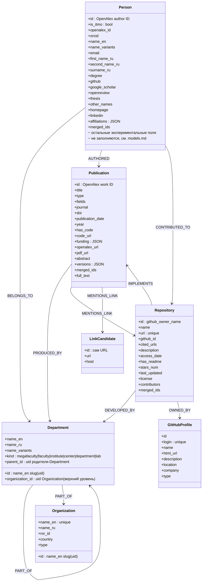

# Схема графа Neo4j

`AUTHORED` несёт `position`/`affiliation`/`affiliation_source`/
`is_corresponding`; `CONTRIBUTED_TO` — `role` (`owner` или `contributor`),
её строит стадия `github_match`; `MENTIONS_LINK` — `context`
(список), `page_number` (список, `0` = абстракт), `is_relevant`,
`llm_confidence`, `llm_reason`. Подробности и уникальные ключи — в
[`../architecture/neo4j-graph.md`](../architecture/neo4j-graph.md).

Иерархия подразделений рекурсивна: подразделение `PART_OF` своего родителя —
либо другого `Department` (`parent_id`), либо корневой `Organization`
(`organization_id`); задано ровно одно из двух. Несколько организаций (ИТМО и
со-аффилиации) сосуществуют в одном графе как разные корни.

Почты и имена из коммитов, которые собирает матчер (`GitHubProfile.emails`,
`commit_names`, `repos`, `Person.emails`), в граф не публикуются: это
доказательства, на которых он строит решение, а не факты об аккаунте —
и это адреса живых людей. Они остаются в prepared JSONL.
