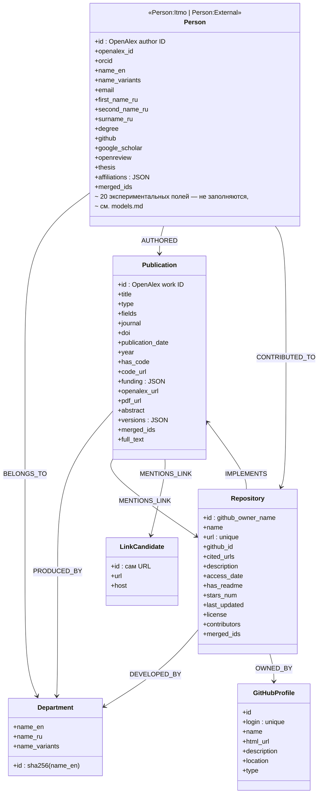

# Схема графа Neo4j

`AUTHORED` несёт `position`/`affiliation`/`affiliation_source`/
`is_corresponding`; `CONTRIBUTED_TO` — `role`; `MENTIONS_LINK` — `context`
(список), `page_number` (список, `0` = абстракт), `is_relevant`,
`llm_confidence`, `llm_reason`. Подробности и уникальные ключи — в
[`../architecture/neo4j-graph.md`](../architecture/neo4j-graph.md).
