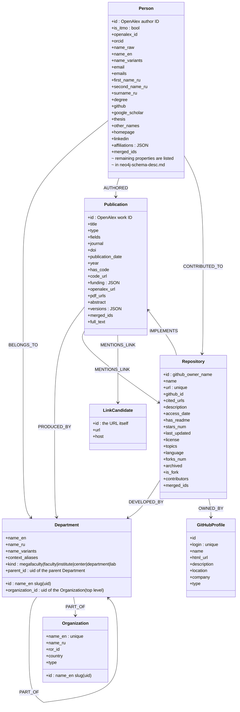

# Neo4j graph schema

```mermaid
classDiagram
    class Person {
        +id : OpenAlex author ID
        +is_itmo : bool
        +openalex_id
        +orcid
        +name_raw
        +name_en
        +name_variants
        +email
        +emails
        +first_name_ru
        +second_name_ru
        +surname_ru
        +degree
        +github
        +google_scholar
        +thesis
        +other_names
        +homepage
        +linkedin
        +affiliations : JSON
        +merged_ids
        ~ remaining properties are listed
        ~ in neo4j-schema-desc.md
    }

    class Organization {
        +id : name_en slug (uid)
        +name_en : unique
        +name_ru
        +ror_id
        +country
        +type
    }

    class Department {
        +id : name_en slug (uid)
        +name_en
        +name_ru
        +name_variants
        +context_aliases
        +kind : megafaculty|faculty|institute|center|department|lab
        +parent_id : uid of the parent Department
        +organization_id : uid of the Organization (top level)
    }

    class Publication {
        +id : OpenAlex work ID
        +title
        +type
        +fields
        +journal
        +doi
        +publication_date
        +year
        +has_code
        +code_url
        +funding : JSON
        +openalex_url
        +pdf_urls
        +abstract
        +versions : JSON
        +merged_ids
        +full_text
    }

    class Repository {
        +id : github_owner_name
        +name
        +url : unique
        +github_id
        +cited_urls
        +description
        +access_date
        +has_readme
        +stars_num
        +last_updated
        +license
        +topics
        +language
        +forks_num
        +archived
        +is_fork
        +contributors
        +merged_ids
    }

    class GitHubProfile {
        +id
        +login : unique
        +name
        +html_url
        +description
        +location
        +company
        +type
    }

    class LinkCandidate {
        +id : the URL itself
        +url
        +host
    }

    Person --> Department : BELONGS_TO
    Person --> Publication : AUTHORED
    Person --> Repository : CONTRIBUTED_TO
    Publication --> Department : PRODUCED_BY
    Publication --> Repository : MENTIONS_LINK
    Publication --> LinkCandidate : MENTIONS_LINK
    Repository --> Department : DEVELOPED_BY
    Repository --> Publication : IMPLEMENTS
    Repository --> GitHubProfile : OWNED_BY
    Department --> Department : PART_OF
    Department --> Organization : PART_OF
```

`AUTHORED` carries `position`, `affiliation`, `affiliation_source` and
`is_corresponding`. `CONTRIBUTED_TO` carries `role` (`owner` or `contributor`)
and is built by the `github_match` stage. `MENTIONS_LINK` carries `context`
(list), `page_number` (list, `0` = abstract), `is_relevant`,
`classification_status`, `llm_confidence`, `llm_reason`, and, for links with
line-wrap alternatives, `url_ambiguous`, `candidate_urls` and `availability`.
Details and unique keys: [`../architecture/neo4j-graph.md`](../architecture/neo4j-graph.md).

The department hierarchy is recursive: a unit is `PART_OF` its parent, either
another `Department` (`parent_id`) or a root `Organization`
(`organization_id`); exactly one of the two is set. Several organizations (ITMO
and co-affiliations) coexist in one graph as separate roots.

Commit-derived data collected by the matcher (`GitHubProfile.emails`,
`commit_names`, `repos`) is not published to the graph: it is evidence for the
matcher's decisions, not a fact about the account, and it consists of real
people's addresses. It stays in the prepared Mongo collections. `Person.emails`
is published, as the set of addresses the author or their pages state.
