# Поток данных пайплайна

Полный путь от внешних API до графа и статики GUI, по стадиям `pauk`
(порядок enrichment-стадий — `ALL_STAGES` в
`pauk/pipeline/stages/__init__.py`).

```mermaid
flowchart TD
    subgraph EXT["Внешние источники"]
        OA["OpenAlex API"]
        CR["Crossref API"]
        ORC["ORCID API"]
        ORV["OpenReview API"]
        GH["GitHub API"]
        LLM["OpenRouter LLM"]
        PDFC["PDF-Crawler-Service<br/>(опционально, PAUK_PDF_CRAWLER_URL)"]
    end

    subgraph MONGO["MongoDB"]
        RAW[("raw<br/>openalex_works, openalex_authors,<br/>crossref, orcid, openreview, github")]
        PUB[("publications")]
        PER[("persons")]
        DEP[("departments")]
        REPO[("repositories")]
        GHP[("github_profiles")]
        RL[("repo_links")]
    end

    STATIC[("data/static/departments_catalog.json")]
    AUDIT[("data/audit/&lt;group&gt;/dedup_candidates.jsonl<br/>журнал решений dedup")]
    NEO[("Neo4j")]
    CACHE[("data/cache/graph_snapshot.json")]
    WEB[("статика: graph-data.js, graph-search.js")]

    CLI_COLLECT["pauk collect"] -->|"GET works по ROR ИТМО / id"| OA
    OA -->|"append: openalex_works"| RAW

    CLI_NORM["pauk normalize"] -->|"читает openalex_works своей группы<br/>+ get_models по id для кросс-групповых ссылок"| RAW
    CLI_NORM -->|"upsert"| PUB
    CLI_NORM -->|"upsert"| PER

    subgraph ENRICH["pauk enrich — стадии по порядку"]
        direction TB
        S1["1. pdf<br/>помечает наличие pdf_url"]
        S2["2. persons<br/>аффилиации, ORCID, профили"]
        S3["3. departments<br/>сопоставление по каталогу"]
        S4["4. code_links<br/>ссылки на код из PDF / абстракта"]
        S5["5. link_relevance<br/>LLM-классификация ссылок"]
        S6["6. repositories<br/>метаданные GitHub"]
        S7["7. dedup<br/>локальное слияние дублей"]
        S1 --> S2 --> S3 --> S4 --> S5 --> S6 --> S7
    end

    PUB <--> S1
    PER <--> S2
    S2 -->|"GET author"| OA
    S2 -->|"GET works по DOI"| CR
    S2 -->|"GET record"| ORC
    S2 -->|"GET profile"| ORV
    S2 -->|"append: crossref, openalex_authors,<br/>orcid, openreview"| RAW
    S3 --> STATIC
    DEP <--> S3
    PER <--> S3
    PUB <--> S3
    PUB <--> S4
    RL <--> S4
    S4 -->|"скачать PDF, если нет pdf_url"| PDFC
    RL <--> S5
    S5 -->|"классифицировать ссылку"| LLM
    REPO <--> S6
    GHP <--> S6
    S6 -->|"GET repo, GET contributors"| GH
    S6 -->|"append: github"| RAW
    PUB <--> S7
    PER <--> S7
    REPO <--> S7
    RL <--> S7
    S7 -->|"читает openalex_authors<br/>(доверенный ORCID)"| RAW
    S7 -->|"AtomicWriter"| AUDIT

    CLI_PUB["pauk publish graph"] -->|"read_rows, все 6 коллекций своей группы"| PUB
    CLI_PUB --> PER
    CLI_PUB --> DEP
    CLI_PUB --> REPO
    CLI_PUB --> GHP
    CLI_PUB --> RL
    CLI_PUB -->|"MERGE: сначала узлы, потом связи"| NEO

    CLI_DEDUP["pauk dedup graph<br/>(по требованию, не часть run)"] -->|"Cypher, весь граф сразу"| NEO
    CLI_DEDUP -->|"кросс-групповой скан<br/>openalex_authors"| RAW

    CLI_CACHE["pauk cache export"] --> NEO
    CLI_CACHE --> CACHE
    GUIGEN["pauk.gui.generate_data /<br/>generate_stats"] --> CACHE
    GUIGEN --> WEB
    SERVE["pauk.gui.serve"] --> WEB
```

`pauk run` = `collect → normalize → enrich` (все стадии) одним вызовом,
но **не включает** `publish graph` — загрузка в общую Neo4j остаётся
отдельным ручным шагом. `dedup` (Cypher, весь граф) тоже отдельная
команда, не часть `run`.

Стрелки `<-->` у стадий `enrich` — «читает и переписывает свою группу
целиком» (`read_rows`/`write_rows`, см. [`../architecture/storage.md`](../architecture/storage.md)),
не построчный поток.
