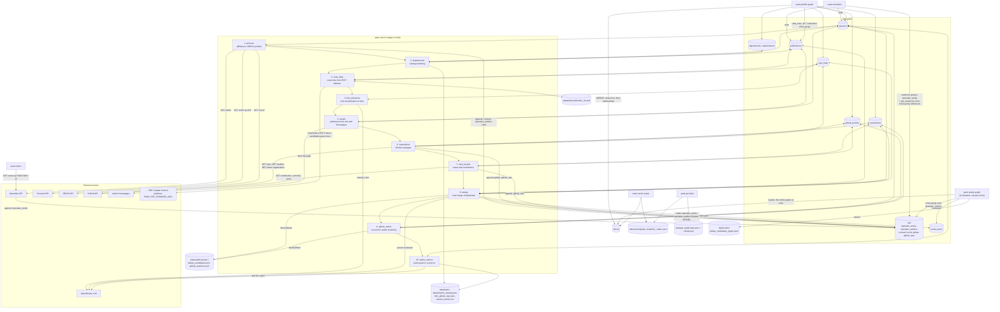

# Pipeline data flow

The full path from external APIs to the graph and the GUI static data, by `pauk`
stage (the order of the enrichment stages is `ALL_STAGES` in
`pauk/pipeline/stages/__init__.py`).

```mermaid
flowchart TD
    subgraph EXT["External sources"]
        OA["OpenAlex API"]
        CR["Crossref API"]
        ORC["ORCID API"]
        GH["GitHub API"]
        LLM["OpenRouter LLM"]
        HOME["Author homepages"]
        PDFC["PDF-Crawler-Service<br/>(optional, PAUK_PDF_CRAWLER_URL)"]
    end

    subgraph MONGO["MongoDB"]
        RAW[("raw<br/>openalex_works, openalex_authors,<br/>crossref, orcid, github, github_user")]
        PUB[("publications")]
        PER[("persons")]
        DEP[("departments, organizations")]
        REPO[("repositories")]
        GHP[("github_profiles")]
        RL[("repo_links")]
        REV[("review_pairs")]
    end

    STATIC[("data/static: departments_catalog.json,<br/>itmo_github_orgs.json, russian_names.csv")]
    PDFS[("data/pdf/&lt;publication_id&gt;.pdf")]
    AUDIT[("data/audit/&lt;group&gt;/<br/>dedup_candidates.jsonl, github_matches.jsonl")]
    NEO[("Neo4j")]
    CACHE[("data/cache/graph_snapshot_&lt;date&gt;.json")]
    WEB[("data/gui: graph-data.json + *-detail.json")]

    CLI_COLLECT["pauk collect"] -->|"GET works by ITMO ROR / id"| OA
    OA -->|"append: openalex_works"| RAW

    CLI_NORM["pauk normalize"] -->|"reads the group's openalex_works<br/>+ get_models by id for cross-group references"| RAW
    CLI_NORM -->|"write"| PUB
    CLI_NORM -->|"write"| PER

    subgraph ENRICH["pauk enrich: stages in order"]
        direction TB
        S1["1. persons<br/>affiliations, ORCID, profiles"]
        S2["2. departments<br/>catalog matching"]
        S3["3. code_links<br/>code links from PDF / abstract"]
        S4["4. link_relevance<br/>LLM classification of links"]
        S5["5. emails<br/>addresses from text and homepages"]
        S6["6. repositories<br/>GitHub metadata"]
        S7["7. repo_people<br/>owner and contributors"]
        S8["8. dedup<br/>local merge of duplicates"]
        S9["9. github_match<br/>account to author matching"]
        S10["10. author_names<br/>name parts in ru and en"]
        S1 --> S2 --> S3 --> S4 --> S5 --> S6 --> S7 --> S8 --> S9 --> S10
    end

    PER <--> S1
    S1 -->|"GET author"| OA
    S1 -->|"GET works by DOI"| CR
    S1 -->|"GET record"| ORC
    S1 -->|"append: crossref, openalex_authors,<br/>orcid"| RAW
    S2 --> STATIC
    DEP <--> S2
    PER <--> S2
    PUB <--> S2
    PUB <--> S3
    RL <--> S3
    S3 -->|"download a PDF if direct candidates gave none"| PDFC
    S3 <--> PDFS
    RL <--> S4
    S4 -->|"classify a link"| LLM
    PUB <--> S5
    PER <--> S5
    S5 -->|"fetch the page"| HOME
    REPO <--> S6
    GHP <--> S6
    RL <--> S6
    S6 -->|"GET repo, GET readme,<br/>GET owner organization"| GH
    S6 -->|"append: github, github_user"| RAW
    REPO <--> S7
    GHP <--> S7
    S7 -->|"GET contributors, commits, users"| GH
    S7 -->|"append: github_user"| RAW
    PUB <--> S8
    PER <--> S8
    REPO <--> S8
    RL <--> S8
    S8 -->|"reads openalex_works,<br/>openalex_authors (trusted ORCID)"| RAW
    S8 -->|"person resolution"| LLM
    S8 -->|"AtomicWriter"| AUDIT
    S8 -->|"held pairs"| REV
    PER <--> S9
    GHP <--> S9
    REPO <--> S9
    S9 -->|"AtomicWriter"| AUDIT
    PER <--> S10
    S10 -->|"split the name"| LLM
    S10 --> STATIC

    CLI_PUB["pauk publish graph"] -->|"read_rows, all 7 collections of the group"| PUB
    CLI_PUB --> PER
    CLI_PUB --> DEP
    CLI_PUB --> REPO
    CLI_PUB --> GHP
    CLI_PUB --> RL
    CLI_PUB -->|"MERGE: nodes first, then relationships"| NEO

    CLI_DEDUP["pauk dedup graph<br/>(on demand, not part of run)"] -->|"Cypher, the whole graph at once"| NEO
    CLI_DEDUP -->|"cross-group scan<br/>openalex_authors"| RAW
    CLI_DEDUP -->|"journal"| CACHE_DIR[("data/cache/<br/>dedup_candidates_graph.jsonl")]
    CLI_DEDUP -->|"held pairs"| REV

    CLI_CACHE["pauk cache export"] --> NEO
    CLI_CACHE --> CACHE
    GUIGEN["pauk gui build"] --> CACHE
    GUIGEN --> WEB
```

`pauk run` is `collect`, `normalize`, `enrich` (all default stages) in one call,
but it does **not** include `publish graph`: loading into the shared Neo4j stays
a separate manual step. `dedup graph` (Cypher, the whole graph) is likewise a
separate command, not part of `run`. The optional `social_graph` stage is not in
the diagram: it starts only by name (see
[`../architecture/pipeline/social-graph.md`](../architecture/pipeline/social-graph.md)).

The `<-->` arrows at the `enrich` stages mean "reads and rewrites its group as a
whole" (`read_rows` / `write_rows`, see
[`../architecture/storage.md`](../architecture/storage.md)), not a row-by-row
stream.
